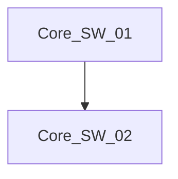

# Sketch Network Topology

You must use this skill to document your findings visually as you traverse the network.

## Usage

Use your built-in bash terminal to run the helper script or write directly to a file:

```bash
cat << 'EOF' > /app/outputs/topology_problem_current.md

EOF
```
