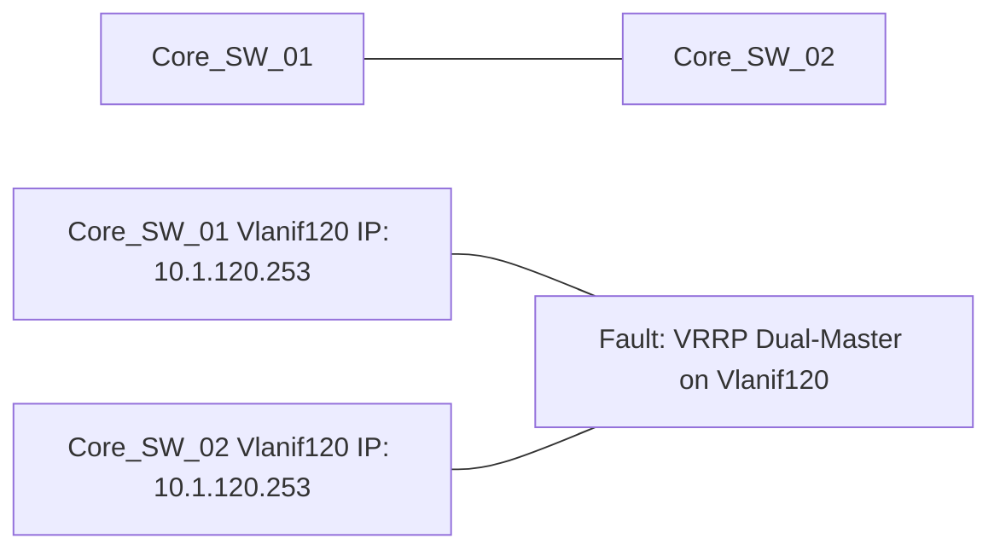

```mermaid
graph LR
  Core_SW_01---Core_SW_02
  note1[Core_SW_01 Vlanif120 IP: 10.1.120.253]
  note2[Core_SW_02 Vlanif120 IP: 10.1.120.253]
  note1---VRRP_Dual_Master[Fault: VRRP Dual-Master on Vlanif120]
  note2---VRRP_Dual_Master
```
