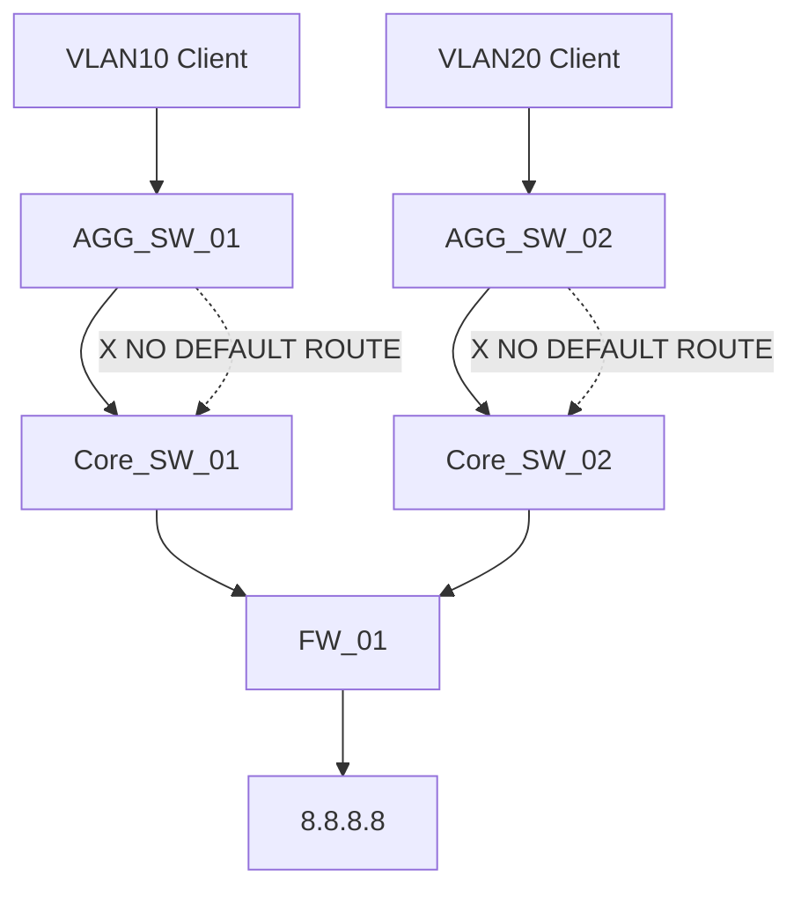

```mermaid
graph TD
    PC1[VLAN10 Client] --> AGG_SW_01
    PC2[VLAN20 Client] --> AGG_SW_02
    AGG_SW_01 --> Core_SW_01
    AGG_SW_02 --> Core_SW_02
    Core_SW_01 --> FW_01
    Core_SW_02 --> FW_01
    FW_01 --> Internet[8.8.8.8]
    
    AGG_SW_01 -.X NO DEFAULT ROUTE.-> Core_SW_01
    AGG_SW_02 -.X NO DEFAULT ROUTE.-> Core_SW_02
```
