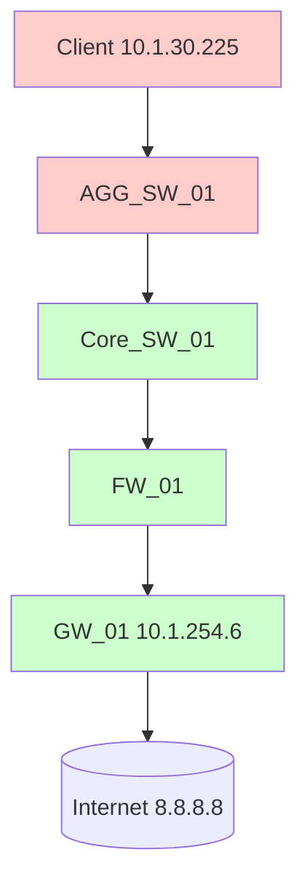

```mermaid
graph TD
    HQ_HR_PC01[Client 10.1.30.225] --> AGG_SW_01[AGG_SW_01]
    AGG_SW_01 --> Core_SW_01[Core_SW_01]
    Core_SW_01 --> FW_01[FW_01]
    FW_01 --> BJHQ_CSR1000V_GW_01[GW_01 10.1.254.6]
    BJHQ_CSR1000V_GW_01 --> Internet[(Internet 8.8.8.8)]
    
    style HQ_HR_PC01 fill:#ffcccc
    style AGG_SW_01 fill:#ffcccc
    style Core_SW_01 fill:#ccffcc
    style FW_01 fill:#ccffcc
    style BJHQ_CSR1000V_GW_01 fill:#ccffcc
```
