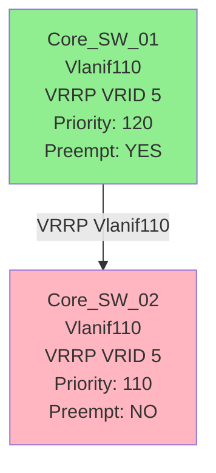

```mermaid
graph TD
  Core_SW_01["Core_SW_01<br>Vlanif110<br>VRRP VRID 5<br>Priority: 120<br>Preempt: YES"] -->|VRRP Vlanif110| Core_SW_02["Core_SW_02<br>Vlanif110<br>VRRP VRID 5<br>Priority: 110<br>Preempt: NO"]
  
  style Core_SW_01 fill:#90EE90
  style Core_SW_02 fill:#FFB6C1
```
