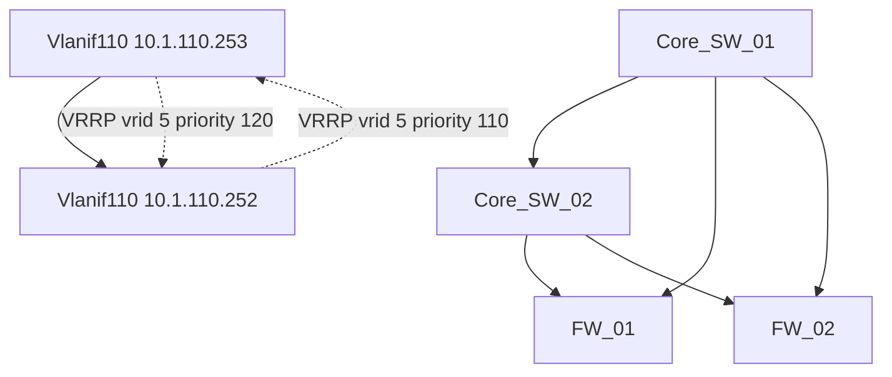

```mermaid
graph TD
  Core_SW_01 --> Core_SW_02
  Core_SW_01 --> FW_01
  Core_SW_01 --> FW_02
  Core_SW_02 --> FW_01
  Core_SW_02 --> FW_02
  Core_SW_01_Vlanif110[Vlanif110 10.1.110.253] --> Core_SW_02_Vlanif110[Vlanif110 10.1.110.252]
  Core_SW_01_Vlanif110 -.->|VRRP vrid 5 priority 120| Core_SW_02_Vlanif110
  Core_SW_02_Vlanif110 -.->|VRRP vrid 5 priority 110| Core_SW_01_Vlanif110
```