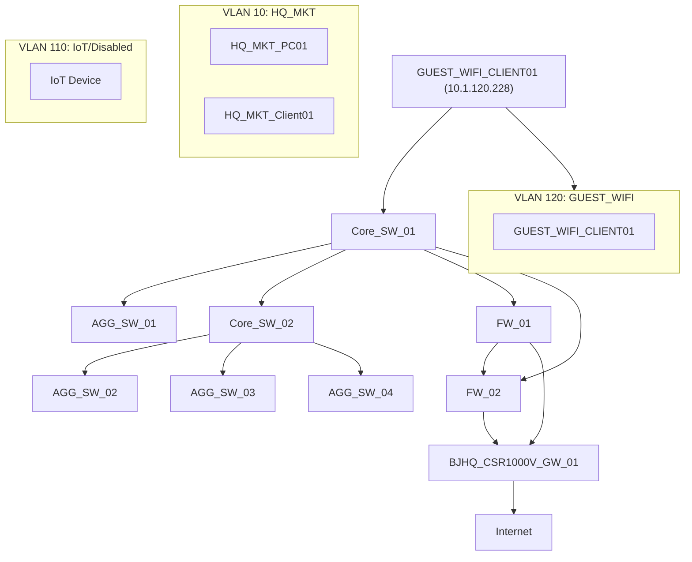

```mermaid
graph TD
    Client["GUEST_WIFI_CLIENT01 (10.1.120.228)"] --> Core_SW_01
    Core_SW_01["Core_SW_01"] --> AGG_SW_01["AGG_SW_01"]
    Core_SW_01 --> Core_SW_02["Core_SW_02"]
    Core_SW_01 --> FW_01["FW_01"]
    Core_SW_01 --> FW_02["FW_02"]
    Core_SW_02 --> AGG_SW_02["AGG_SW_02"]
    Core_SW_02 --> AGG_SW_03["AGG_SW_03"]
    Core_SW_02 --> AGG_SW_04["AGG_SW_04"]
    FW_01 --> FW_02
    FW_01 --> GW["BJHQ_CSR1000V_GW_01"]
    FW_02 --> GW
    GW --> Internet[Internet]
    
    subgraph VLAN10["VLAN 10: HQ_MKT"]
    PC["HQ_MKT_PC01"]
    Client01["HQ_MKT_Client01"]
    end
    
    subgraph VLAN110["VLAN 110: IoT/Disabled"]
    IoT["IoT Device"]
    end
    
    subgraph VLAN120["VLAN 120: GUEST_WIFI"]
    Guest["GUEST_WIFI_CLIENT01"]
    end
    
    Client --> VLAN120
```
