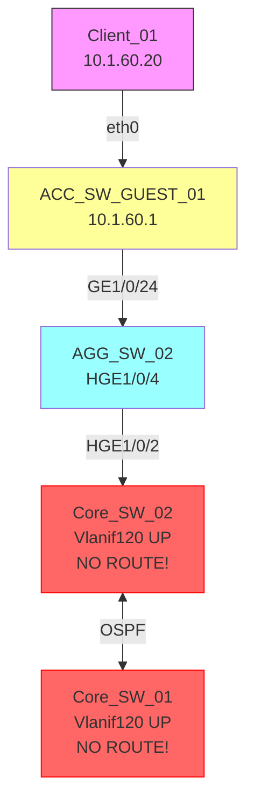

```mermaid
graph TD
    PC[Client_01<br/>10.1.60.20] -->|eth0| ACC_SW_GUEST_01[ACC_SW_GUEST_01<br/>10.1.60.1]
    ACC_SW_GUEST_01 -->|GE1/0/24| AGG_SW_02[AGG_SW_02<br/>HGE1/0/4]
    AGG_SW_02 -->|HGE1/0/2| Core_SW_02[Core_SW_02<br/>Vlanif120 UP<br/>NO ROUTE!]
    Core_SW_02 <-->|OSPF| Core_SW_01[Core_SW_01<br/>Vlanif120 UP<br/>NO ROUTE!]
    
    style PC fill:#f9f,stroke:#333
    style ACC_SW_GUEST_01 fill:#ff9
    style AGG_SW_02 fill:#9ff
    style Core_SW_02 fill:#f66,stroke:#f00
    style Core_SW_01 fill:#f66,stroke:#f00
```
