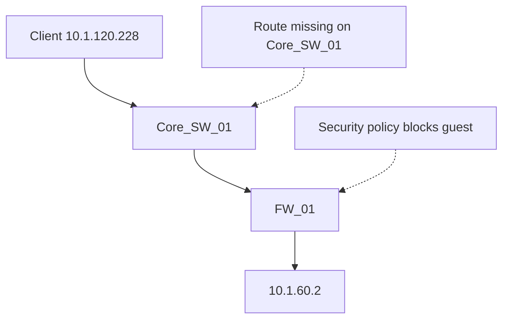

```mermaid
graph TD
  GUEST_WIFI_CLIENT01[Client 10.1.120.228] --> Core_SW_01[Core_SW_01]
  Core_SW_01 --> FW_01[FW_01]
  FW_01 --> Target[10.1.60.2]
  note1[Route missing on Core_SW_01] -.-> Core_SW_01
  note2[Security policy blocks guest] -.-> FW_01
```
