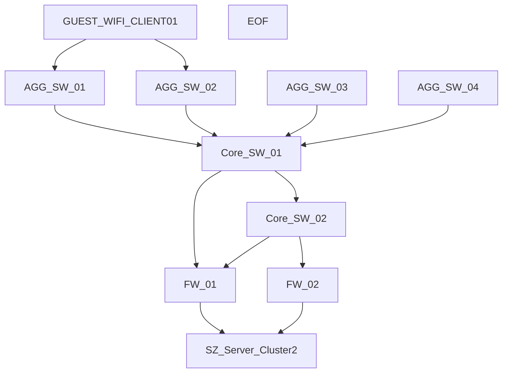

```mermaid
graph TD
  GUEST_WIFI_CLIENT01 --> AGG_SW_01
  GUEST_WIFI_CLIENT01 --> AGG_SW_02
  AGG_SW_01 --> Core_SW_01
  AGG_SW_02 --> Core_SW_01
  AGG_SW_03 --> Core_SW_01
  AGG_SW_04 --> Core_SW_01
  Core_SW_01 --> Core_SW_02
  Core_SW_01 --> FW_01
  Core_SW_02 --> FW_01
  Core_SW_02 --> FW_02
  FW_01 --> SZ_Server_Cluster2
  FW_02 --> SZ_Server_Cluster2
EOF
```
