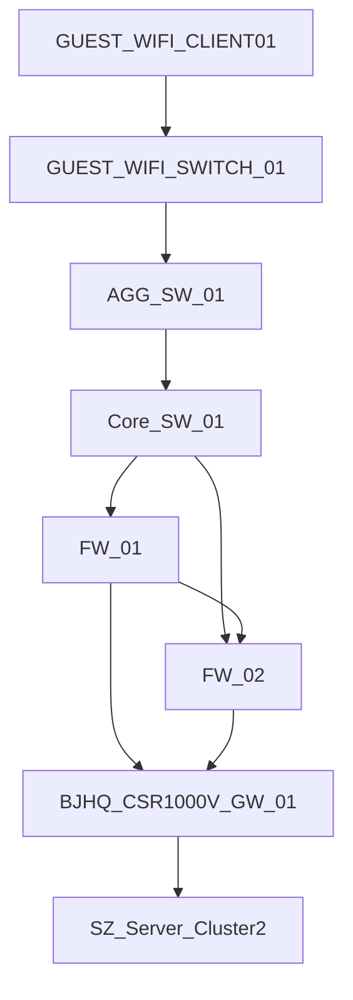

```mermaid
graph TD
    GUEST_WIFI_CLIENT01 --> GUEST_WIFI_SWITCH_01
    GUEST_WIFI_SWITCH_01 --> AGG_SW_01
    AGG_SW_01 --> Core_SW_01
    Core_SW_01 --> FW_01
    Core_SW_01 --> FW_02
    FW_01 --> FW_02
    FW_01 --> BJHQ_CSR1000V_GW_01
    FW_02 --> BJHQ_CSR1000V_GW_01
    BJHQ_CSR1000V_GW_01 --> SZ_Server_Cluster2
```
