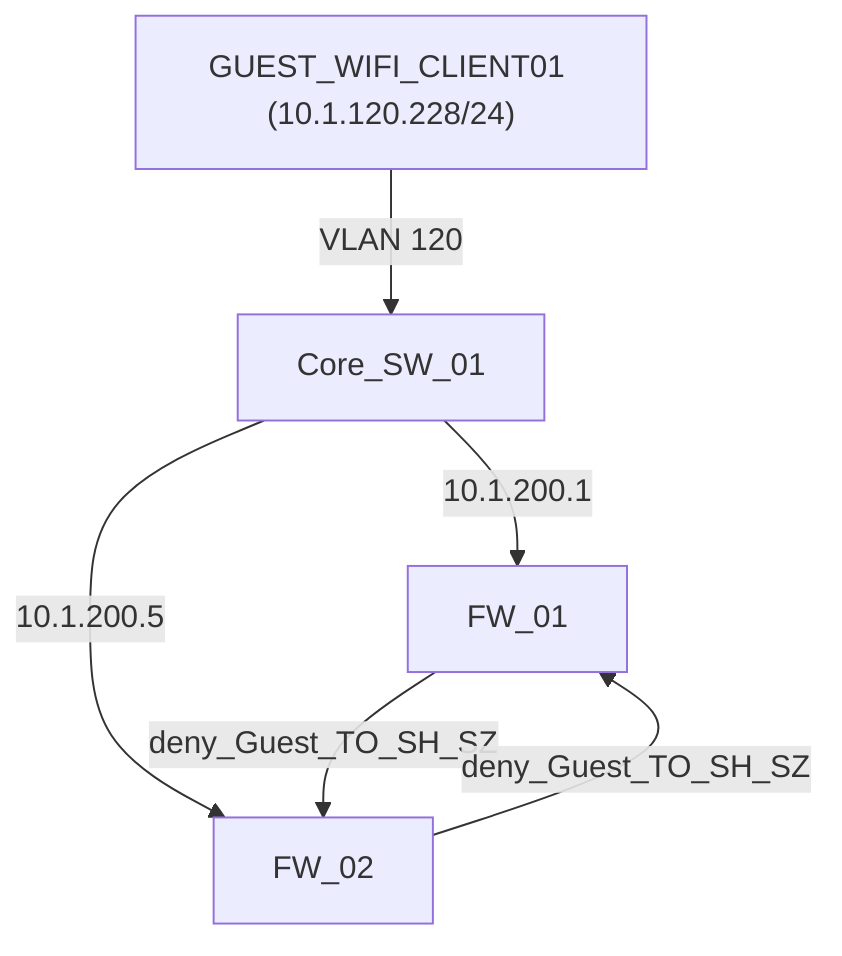

```mermaid
graph TD
  GUEST_WIFI_CLIENT01["GUEST_WIFI_CLIENT01 (10.1.120.228/24)"]
  Core_SW_01["Core_SW_01"]
  FW_01["FW_01"]
  FW_02["FW_02"]
  
  GUEST_WIFI_CLIENT01 -->|VLAN 120| Core_SW_01
  Core_SW_01 -->|10.1.200.1| FW_01
  Core_SW_01 -->|10.1.200.5| FW_02
  
  FW_01 -->|deny_Guest_TO_SH_SZ| FW_02
  FW_02 -->|deny_Guest_TO_SH_SZ| FW_01
```
