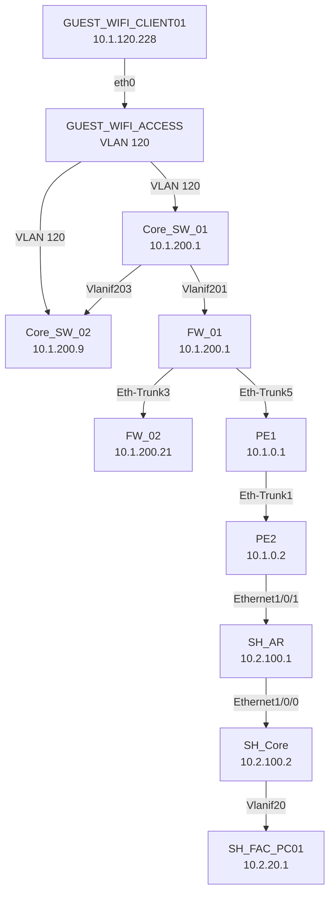

```mermaid
graph TD
    GUEST_CLIENT[GUEST_WIFI_CLIENT01<br/>10.1.120.228]
    SW_ACCESS[GUEST_WIFI_ACCESS<br/>VLAN 120]
    CORE1[Core_SW_01<br/>10.1.200.1]
    CORE2[Core_SW_02<br/>10.1.200.9]
    FW1[FW_01<br/>10.1.200.1]
    FW2[FW_02<br/>10.1.200.21]
    PE1[PE1<br/>10.1.0.1]
    PE2[PE2<br/>10.1.0.2]
    SH_AR[SH_AR<br/>10.2.100.1]
    SH_CORE[SH_Core<br/>10.2.100.2]
    SH_PC[SH_FAC_PC01<br/>10.2.20.1]
    
    GUEST_CLIENT -->|eth0| SW_ACCESS
    SW_ACCESS -->|VLAN 120| CORE1
    SW_ACCESS -->|VLAN 120| CORE2
    CORE1 -->|Vlanif201| FW1
    CORE1 -->|Vlanif203| CORE2
    FW1 -->|Eth-Trunk5| PE1
    FW1 -->|Eth-Trunk3| FW2
    PE1 -->|Eth-Trunk1| PE2
    PE2 -->|Ethernet1/0/1| SH_AR
    SH_AR -->|Ethernet1/0/0| SH_CORE
    SH_CORE -->|Vlanif20| SH_PC
```
