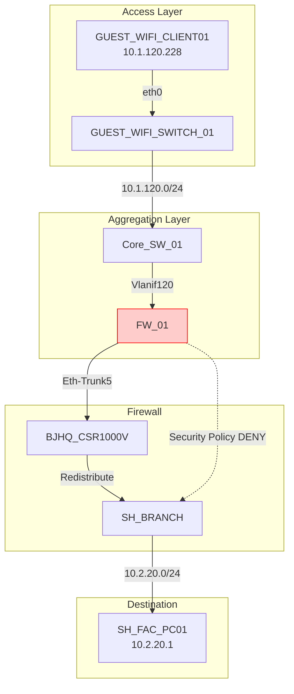

```mermaid
graph TD
    GUEST_WIFI_CLIENT01[GUEST_WIFI_CLIENT01<br/>10.1.120.228]
    
    subgraph Access Layer
        GUEST_WIFI_CLIENT01 -->|eth0| GUEST_WIFI_SWITCH_01
    end
    
    subgraph Aggregation Layer
        GUEST_WIFI_SWITCH_01 -->|10.1.120.0/24| Core_SW_01
        Core_SW_01 -->|Vlanif120| FW_01
    end
    
    subgraph Firewall
        FW_01 -->|Eth-Trunk5| BJHQ_CSR1000V
        BJHQ_CSR1000V -->|Redistribute| SH_BRANCH
    end
    
    subgraph Destination
        SH_BRANCH -->|10.2.20.0/24| SH_FAC_PC01[SH_FAC_PC01<br/>10.2.20.1]
    end
    
    FW_01 -.->|Security Policy DENY| SH_BRANCH
    style FW_01 fill:#ffcccc,stroke:#ff0000
```
