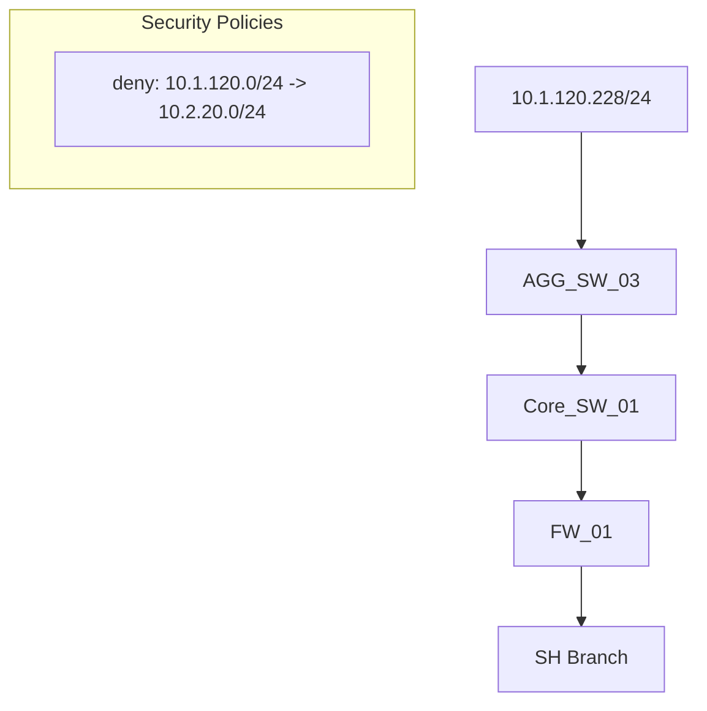

```mermaid
graph TD
    GUEST_WIFI_CLIENT01[10.1.120.228/24] --> AGG_SW_03
    AGG_SW_03 --> Core_SW_01
    Core_SW_01 --> FW_01
    FW_01 --> BJHQ_CSR1000V_GW_01[SH Branch]
    
    subgraph Security Policies
        deny_Guest_TO_SH_SZ[deny: 10.1.120.0/24 -> 10.2.20.0/24]
    end
```
