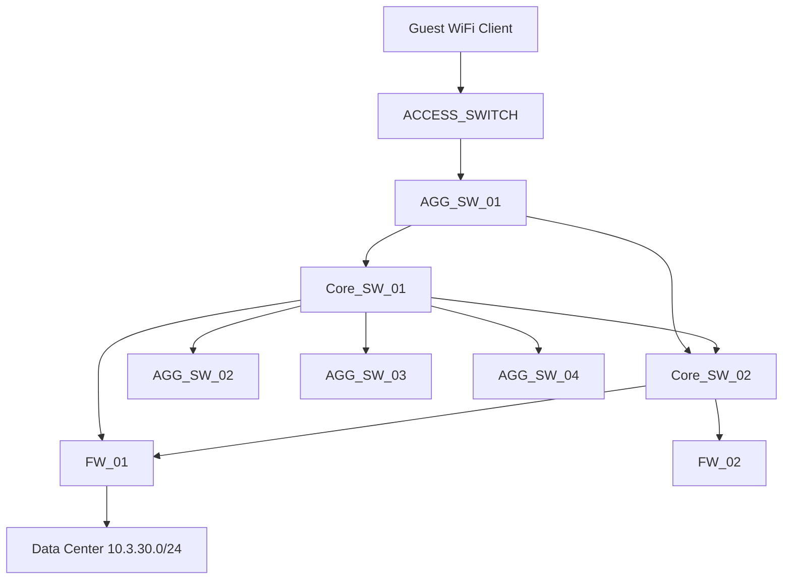

```mermaid
graph TD
  GUEST_WIFI_CLIENT02[Guest WiFi Client] --> ACCESS_SWITCH
  ACCESS_SWITCH --> AGG_SW_01
  AGG_SW_01 --> Core_SW_01
  AGG_SW_01 --> Core_SW_02
  Core_SW_01 --> Core_SW_02
  Core_SW_01 --> FW_01
  Core_SW_01 --> AGG_SW_02
  Core_SW_01 --> AGG_SW_03
  Core_SW_01 --> AGG_SW_04
  Core_SW_02 --> FW_01
  Core_SW_02 --> FW_02
  FW_01 --> DATA_CENTER[Data Center 10.3.30.0/24]
```
