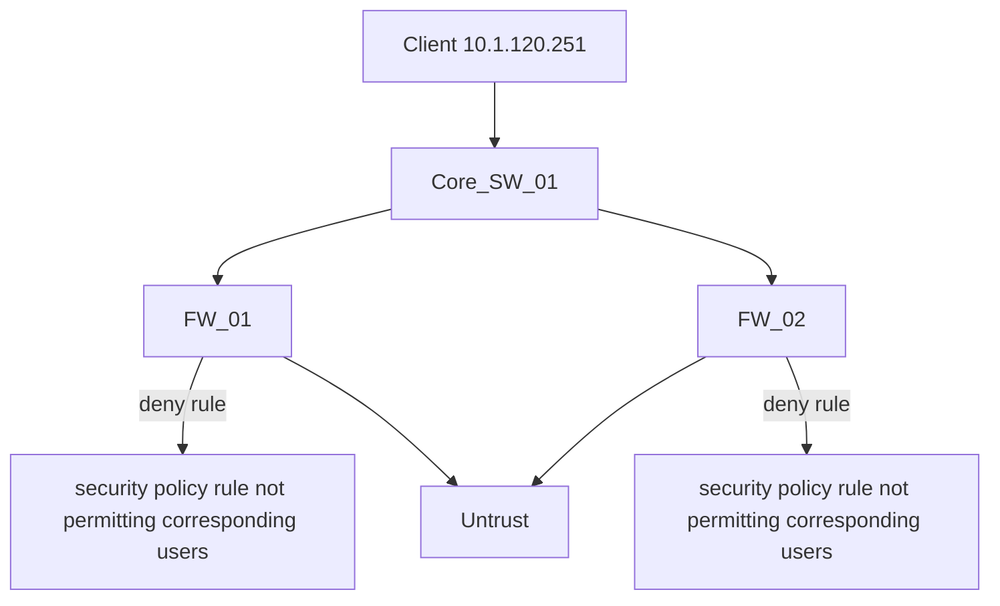

```mermaid
graph TD
  GUEST_WIFI_CLIENT03[Client 10.1.120.251] --> Core_SW_01[Core_SW_01]
  Core_SW_01 --> FW_01[FW_01]
  FW_01 -->|deny rule| DENY[security policy rule not permitting corresponding users]
  Core_SW_01 --> FW_02[FW_02]
  FW_02 -->|deny rule| DENY2[security policy rule not permitting corresponding users]
  FW_01 --> Untrust
  FW_02 --> Untrust
```
