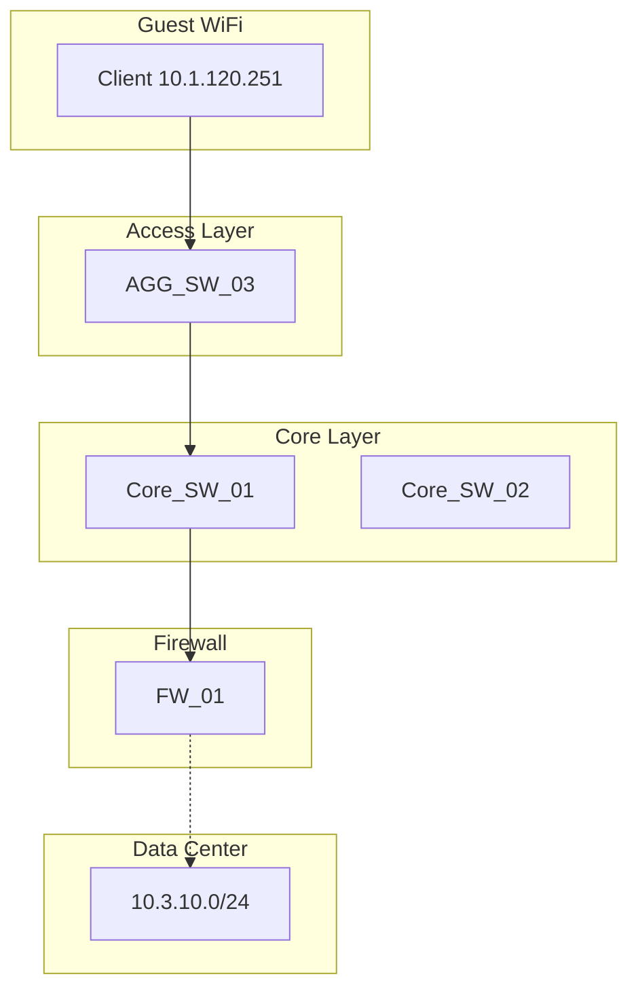

```mermaid
graph TD
    subgraph "Guest WiFi"
        GUEST_WIFI_CLIENT03[Client 10.1.120.251]
    end
    
    subgraph "Access Layer"
        AGG_SW_03[AGG_SW_03]
    end
    
    subgraph "Core Layer"
        Core_SW_01[Core_SW_01]
        Core_SW_02[Core_SW_02]
    end
    
    subgraph "Firewall"
        FW_01[FW_01]
    end
    
    subgraph "Data Center"
        SZ_Server[10.3.10.0/24]
    end
    
    GUEST_WIFI_CLIENT03 --> AGG_SW_03
    AGG_SW_03 --> Core_SW_01
    Core_SW_01 --> FW_01
    FW_01 -.->SZ_Server
```
